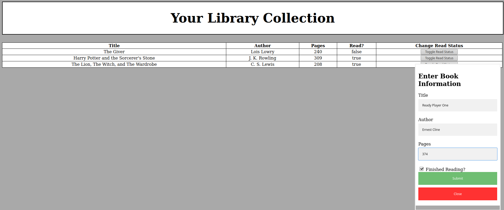

# Digital-Library
This is a web application that allows users to add books they may have read to an online library. 
To use, simply press the round "+" icon on the bottom right of the screen.
This will bring up a form where you will enter your book's title, author, and pages.
After pressing submit, your book will appear on the list.
To toggle whether or not you have finished reading a book, simply press the 'Toggle Read 
Status' button on the row of your chosen book.

